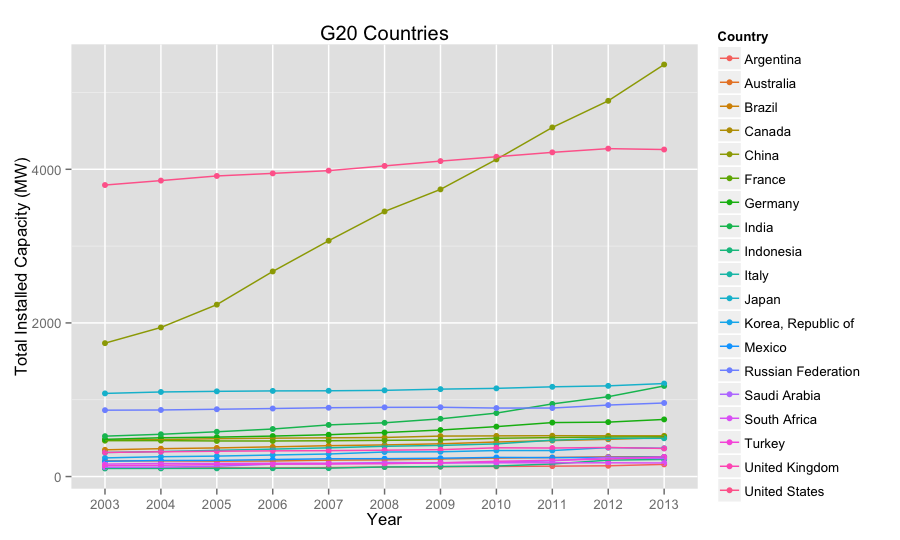

---
title       : Enerygy Statistic Database
subtitle    : Electric, net installed capacity of electric power plants | United Nations Statistics Division
author      : Trieu Tran
job         : 
framework   : io2012        # {io2012, html5slides, shower, dzslides, ...}
highlighter : highlight.js  # {highlight.js, prettify, highlight}
hitheme     : tomorrow      # 
widgets     : []            # {mathjax, quiz, bootstrap}
mode        : selfcontained # {standalone, draft}
knit        : slidify::knit2slides

--- .class #s1
## Introduction
<p>Lorem Ipsum</p>

--- .class #s2
## Data
1. Where to get data
URL: http://data.un.org/Data.aspx?d=EDATA&f=cmID%3aEC

2. Take a quick look at the data

```
## 'data.frame':	47591 obs. of  6 variables:
##  $ Country.or.Area        : Factor w/ 242 levels "1","Afghanistan",..: 2 2 2 2 2 2 2 2 2 2 ...
##  $ Commodity...Transaction: Factor w/ 38 levels "Electricity - net installed capacity of electric power plants public solar",..: 20 20 20 20 20 20 20 20 20 20 ...
##  $ Year                   : int  2013 2012 2011 2010 2009 2008 2007 2006 2005 2004 ...
##  $ Unit                   : Factor w/ 1 level "Kilowatts,  thousand": 1 1 1 1 1 1 1 1 1 1 ...
##  $ Quantity               : num  431 431 431 489 489 489 489 489 489 489 ...
##  $ Quantity.Footnotes     : int  1 NA NA 1 1 NA 1 1 1 1 ...
```

--- .class #s3 
## Data visualization
### Total net installed capacity of electric power plants of G20 countries 
##### Graph generation code


```r
countries <- c("Argentina", "Australia", "Brazil", "Canada", "China", "France", "Germany", "India", "Indonesia", "Italy", 
                         "Japan", "Mexico", "Russian Federation", "Saudi Arabia", "South Africa", "Korea, Republic of", "Turkey", "United Kingdom", 
                         "United States")

results <- d %>%
        filter(Year > 2002) %>%
        filter(code == "I") %>%
        filter(Country %in%  countries) %>%
        group_by(Country, Year) %>%
        summarise(ttl = sum(Quantity)/1000)

p <- ggplot(data = results, aes(x = factor(Year), y = ttl, color = Country))
p <- p + geom_point() + aes(group = Country) + geom_line() 
p <- p + labs(x = "Year", y = "Total Installed Capacity (MW)", title = "G20 Countries")

ggsave(file.path(figureDir, "plot1.png"), width=9.6, height=5.4, dpi=100)
```

--- .class #s4 
## Data visualization
### Total net installed capacity of electric power plants of G20 countriess 


--- .class #s5
## Learn More

Visit my shiny app: [link](www.rstudio.com)


